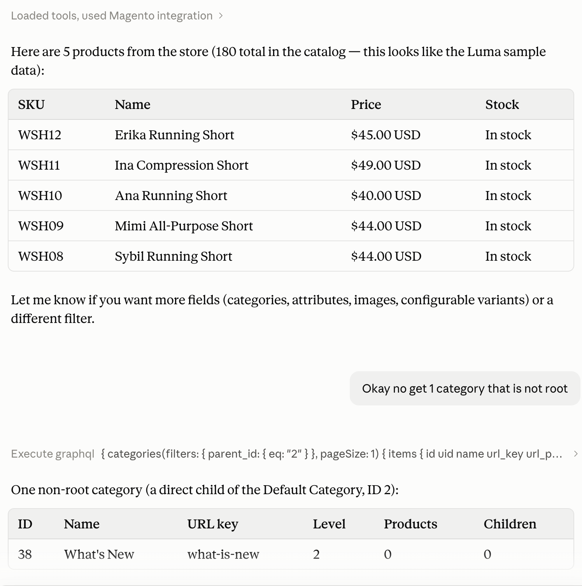

# Magento Connector MCP Module

**Magento Connector MCP Module** turns a Magento 2 / Adobe Commerce store into a
[Model Context Protocol (MCP)](https://modelcontextprotocol.io) server, so Claude can run
**read-only GraphQL queries** - products, categories, customers, orders, and anything else
the store's schema exposes - on behalf of an authenticated admin, using that admin's own
Magento permissions.

It connects to Claude exactly like any other MCP integration: as a **normal custom
connector** in Claude.ai / Claude Desktop (Settings > Connectors > Add - the same flow you'd
use for any other service) over a standard OAuth 2.1 flow, or as a local MCP server for
Claude Code. No special Claude-side support is needed either way.

Two transports, same underlying tools and safety guarantees either way:

- **stdio** - a local subprocess (`bin/magento mcp:serve`), for Claude Code / Claude Desktop's
  local MCP config. No network, no OAuth - trust comes from "you can already run `bin/magento`
  on this server."
- **HTTP + OAuth 2.1** - a real "custom connector" (`/mcp`, with DCR/PKCE/consent screen under
  `admin/upturnstudio_mcp/oauth/authorize`), for Claude.ai's hosted apps. Requires the site to
  be reachable over public HTTPS.

For background and a walkthrough, see the blog post:
[Magento MCP Claude Connector](https://upturnstudio.com.au/blog/magento-mcp-claude-connector).

## Example

Claude calling `execute_graphql` against a live store, then narrowing the query based on the
result - no hand-written integration code, just the schema:



## Installation

```bash
composer require upturnstudio/module-mcp
bin/magento module:enable UpturnStudio_Mcp
bin/magento setup:upgrade
bin/magento cache:flush
```

Running in production mode? Also run `bin/magento setup:di:compile` before `cache:flush`.

## Setup

1. **Grant the permission.** A brand-new ACL resource, `UpturnStudio_Mcp::connector`
   ("AI Connector (MCP)"), gates who can authorize this connector at all. It is **not**
   granted to any role automatically - go to Admin > System > Permissions > User Roles and
   add it to whichever role(s) should be allowed to connect Claude.
2. **(HTTP transport only) Set the public base URL.** Stores > Configuration > Advanced >
   AI Connector (MCP) > Public Base URL must be a real `https://` URL this store is reachable
   at, with **no path** (e.g. `https://your-domain.com`, not `.../mcp`) - it's the OAuth
   issuer and MCP resource identifier, and must never change once a client has registered
   against it. Not needed for the stdio transport. See "Using it remotely" below for the
   actual URL to give Claude, which is this value *plus* `/mcp`.
3. **(Optional) Set a PageSpeed Insights API key.** Stores > Configuration > Advanced >
   AI Connector (MCP) > Core Web Vitals > PageSpeed Insights API Key. Only used by the
   `check_core_web_vitals` tool - leave blank to use Google's free, unauthenticated tier
   (lower rate limit).

## Using it locally (stdio)

```bash
bin/magento mcp:serve --admin-user=<username>
```

`--admin-user` is a real Magento admin *username* (not email, not display name) that already
has the permission above. Point Claude Code/Desktop's local MCP config at it directly:

```json
{
  "mcpServers": {
    "magento-demo": {
      "command": "/path/to/php",
      "args": ["/path/to/bin/magento", "mcp:serve", "--admin-user=admin"]
    }
  }
}
```

To interactively poke at it with the official MCP Inspector instead of a real client:

```bash
bin/magento mcp:inspector --admin-user=<username>
```

This shells out to `npx @modelcontextprotocol/inspector` with the right invocation pre-built
(config file, `protocolEra`, etc.) and auto-switches to a working Node version via nvm first
if the active one is too old for the Inspector's own dependencies. Add `--cli` for one-shot
scripted calls (`-- --method tools/list --format json`) instead of the interactive web UI.
Requires Node.js/npx; this only launches the Inspector, it doesn't bundle it.

## Using it remotely (HTTP + OAuth)

This works as a completely standard custom connector - no special setup on Claude's side.
In Claude.ai: **Settings > Connectors > Add custom connector**, and paste the public base URL
**with `/mcp` appended** - not the bare domain. For example, if the Public Base URL configured
above is `https://your-domain.com`, enter:

```
https://your-domain.com/mcp
```

(Claude Code / Claude Desktop: add it as a remote server pointed at that same `/mcp` URL
instead.) This has to be reachable over the public internet - a local `.test`/`.localhost`
domain only works with the stdio transport above, not this one.

After adding it, Claude handles the rest automatically:

1. Claude requests that URL, gets a `401`, and follows it to this store's OAuth endpoints
   (`/.well-known/oauth-protected-resource`, then `/.well-known/oauth-authorization-server`).
2. Claude registers itself as a client (`/register`) - nothing for the admin to do here.
3. A browser tab opens to `admin/upturnstudio_mcp/oauth/authorize`. If the admin isn't already
   logged into Magento admin, they're asked to log in first, then shown a consent screen
   naming the connector and asking them to Allow or Deny it.
4. On Allow, Claude exchanges the result for its own token and the connector is ready to use.

Connected apps can be reviewed and revoked afterwards at Admin > System > AI Connector (MCP).

The token Claude receives is **not** a Magento admin token - it only works against this
module's own `/mcp` endpoint. Internally, a real (short-lived, never cached) Magento admin
token is minted per call so Magento's own GraphQL resolvers and ACL checks see a genuine,
live admin identity.

## Tools

- **`execute_graphql`** - runs a GraphQL query. Read-only: any `mutation` operation is refused
  before it's ever sent to Magento, regardless of what the admin's own role would otherwise
  permit.
- **`introspect_graphql_schema`** - returns the full schema via standard introspection, so
  Claude can discover what's queryable without guessing.
- **`check_core_web_vitals`** - given a store page URL, reports its Core Web Vitals (field
  data plus a live Lighthouse run, via Google PageSpeed Insights) and resolves that URL to the
  Magento entity behind it - product, category, or CMS page, including its entity ID - so a
  follow-up `execute_graphql` query (or a human editing it directly) knows exactly which
  record to target. Read-only, like everything else here: it identifies the entity, it
  doesn't touch it.

`execute_graphql` and `introspect_graphql_schema` run through Magento's real `/graphql`
endpoint internally (not in-process GraphQL classes) - the schema's own DI wiring is scattered
across ~50 modules' `etc/graphql/di.xml` files and isn't safely reproducible from another
area, so this reuses it as-is instead. `check_core_web_vitals` also uses this same `/graphql`
endpoint (via the standard `route` query) to resolve the entity.

## Adding more tools

Other modules can register additional tools without touching this one. Implement
`UpturnStudio\Mcp\Api\ToolInterface`:

```php
class MyTool implements \UpturnStudio\Mcp\Api\ToolInterface
{
    public function getName(): string
    {
        return 'my_tool';
    }

    public function getDefinition(): array
    {
        return [
            'description' => 'What this tool does.',
            'inputSchema' => ['type' => 'object', 'properties' => (object) []],
        ];
    }

    public function execute(int $adminUserId, array $arguments): array
    {
        // Return an array on success. Throw ToolExecutionException to signal a refusal
        // or failure (isError: true) instead of encoding it in the return value.
        return ['ok' => true];
    }
}
```

Then register it from your own module's `etc/di.xml`:

```xml
<type name="UpturnStudio\Mcp\Model\Mcp\ToolRegistry">
    <arguments>
        <argument name="tools" xsi:type="array">
            <item name="myTool" xsi:type="object">Vendor\Module\Model\Mcp\Tool\MyTool</item>
        </argument>
    </arguments>
</type>
```

It shows up in `tools/list` and is callable via `tools/call` on both transports automatically
- nothing in this module needs to change. Tool names must be unique; a later-merged entry
with the same `getName()` replaces an earlier one, the same way Magento's DI array arguments
normally merge.

## Security notes

- Opaque access/refresh tokens are scoped to this connector only - they're useless against
  Magento's real `/rest` or `/graphql` if leaked.
- An admin's connector access is re-checked live on every single call (not just at OAuth
  grant time) - disabling the admin account in Magento takes effect immediately, even for an
  already-issued, unexpired token.
- Refresh tokens rotate on every use; replaying an already-rotated one revokes the entire
  token family and forces re-consent.
